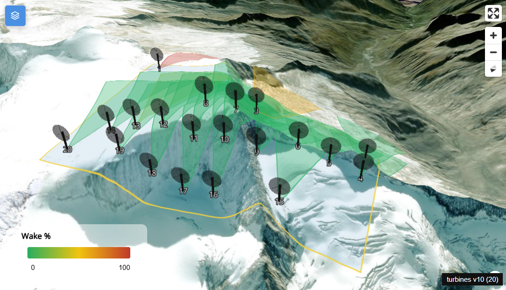
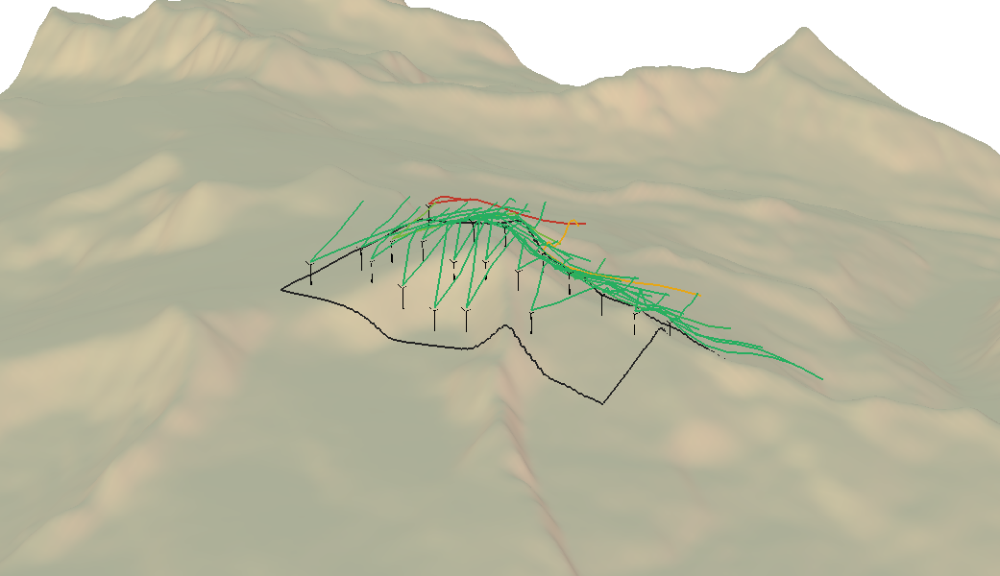
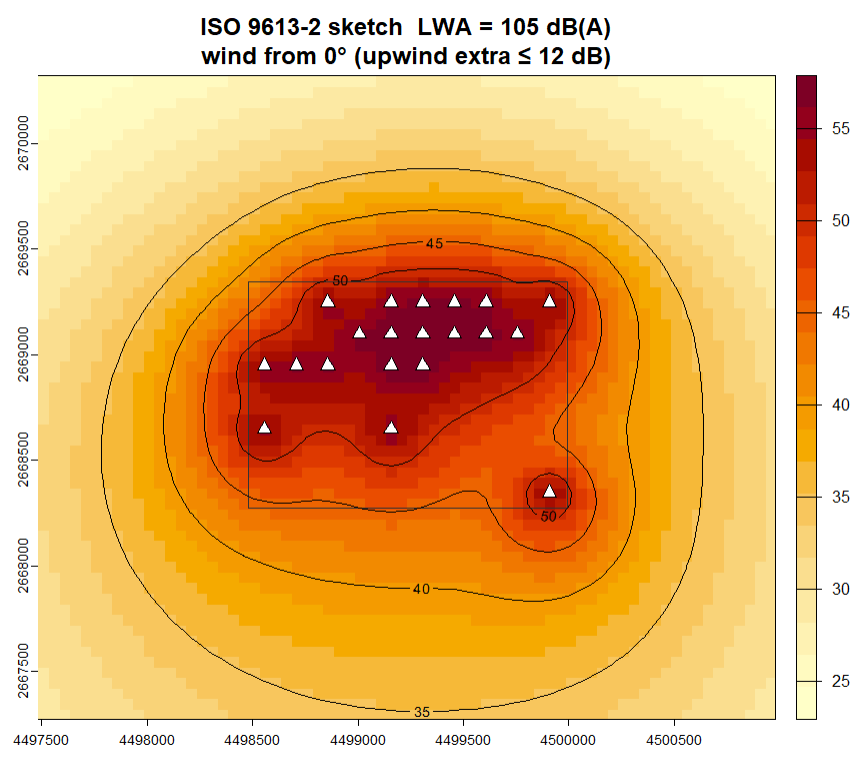

# Experimental (GitHub only)

Scripts here are **not** in the CRAN tarball (see `.Rbuildignore`).
They are not loaded with the package. Open them with `source()` after
installing any extra packages they need.

| File | What | Extra packages |
|---|---|---|
| `draw_shape.R` | Draw a site polygon in Leaflet, then run the GA. Needs `mapedit` >= 0.8 and `leafpm`| leaflet, mapedit (>= 0.8), leafpm |
| `circle_overlap_app.R` | Shiny slider for 3D-`circle_intersection()` | shiny, ggplot2, ggforce |
| `climate_helpers.R` | `wind_from_breeze()`, `wind_from_era5()`, `nrel_fetch_curve()`, `gwa_download_country()` | bReeze / ecmwfr optional; internet for NREL and GWA |
| `download_ERA5_historic.R` | `get_era5_wind(polygon)` — CDS 100 m u/v at the nearest grid point. Then `wind_from_era5(era5)` | ecmwfr, ncdf4, dplyr, lubridate; env `COPERNICUS_CLIMATE_DATA` |
| `noise.R` | ISO 9613-2 sketch (`noise_map`, `noise_from_result`). Downwind Adiv+Aatm+Agr plus optional upwind extra from the wind rose. Not a legal study, not in fitness. | terra, sf |
| `rayshader.R` | `plot_farm_3d` / `plot_farm_3d_from_result` — buffered DEM, wind arrow, wake cones, pins colored by `AbschGesamt`. Heavy install. | rayshader, rgl, elevatr |
| `plot_mapgl.R` | `plot_mapgl_from_result()` — interactive MapLibre 3D map (see below). | mapgl, terra, sf, elevatr, png, jsonlite, httpuv, htmlwidgets; RSQLite for `.mbtiles` |


## `plot_mapgl_from_result()`

Interactive **MapLibre** view of a GA layout on a local Terrarium DEM:
black OBJ turbines (same mesh as rayshader, `wind_turbine_v1.obj`), wake cones colored by `AbschGesamt` (0 % green → max red), and optional
satellite / topo overlays. Pitch can go to 85°.

<p align="center">
  
</p>

```r
source("experimental/plot_mapgl.R")
plot_mapgl_from_result(result, area, buffer = 8000, basemap = "satellite", exaggeration = 1)
```

### What it does

1. Reuses `terrain_tiles/` + `terrain.mbtiles` when they already exist.
   Set `rebuild = TRUE` to remake the DEM tiles (elevatr download unless you pass `dem`).
2. Serves tiles at `http://127.0.0.1:8000` (leftover servers on that
   port are stopped). TileJSON uses Terrarium encoding; `maxzoom` is the highest zoom folder on disk.
3. Draws the site outline, wake cones, numbered labels, and the 3D
   turbine mesh. The nose faces into the dominant wind (`wind_to`).

Generated tiles / `terrain.mbtiles` / `terrain_tiles.json` are gitignored and Rbuildignored. Three.js r149 is downloaded once into `terrain_tiles/`.


## `plot_farm_3d_from_result()`

Interactive RGL view of a GA layout on a DEM:
black OBJ turbines (`wind_turbine_v1.obj`), wake cones colored by `AbschGesamt` (0 % green → max red).

<p align="center">
  
</p>


## `noise_from_result()`

Simplified sound propagation based on ISO 9613-2, including geometric spreading (Adiv), atmospheric absorption (Aatm), and ground effects (Agr), with optional additional upwind attenuation derived from the wind rose.

<p align="center">
  
</p>