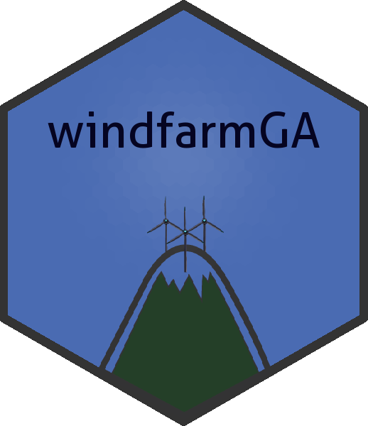

# windfarmGA: Genetic Algorithm for Wind Farm Layout Optimization

The genetic algorithm is designed to optimize wind farms of any shape.
Each layout is encoded as n unique grid-cell identifiers. It requires a
predefined amount of turbines, a unified rotor radius and an average
wind speed value for each incoming wind direction. A terrain effect
model can be included that downloads an 'SRTM' elevation model and loads
a Corine Land Cover raster to approximate surface roughness.

## Details

 A package to optimize
small wind farms with irregular shapes using a genetic algorithm. Each
individual is `n` unique grid-cell IDs (set-crossover, swap-mutation).
It requires a fixed amount of turbines, a fixed rotor radius and an
average wind speed value for each incoming wind direction. A terrain
effect model can be included which downloads a digital elevation model
and a Corine Land Cover raster to approximate surface roughness. Further
information can be found at the description of the function
[`genetic_algorithm`](https://YsoSirius.github.io/windfarmGA/reference/genetic_algorithm.md).

## See also

Useful links:

- [Documentation Github.io](https://ysosirius.github.io/windfarmGA/)

- [Documentation](https://github.com/YsoSirius/windfarmGA)

- [Master
  Thesis](https://homepage.boku.ac.at/jschmidt/TOOLS/Masterarbeit_Gatscha.pdf)

- [Shiny App](https://windfarmga.shinyapps.io/windga_shiny)

- [Report Issues](https://github.com/YsoSirius/windfarmGA/issues)

## Author

**Maintainer**: Sebastian Gatscha <sebastian_gatscha@gmx.at>
